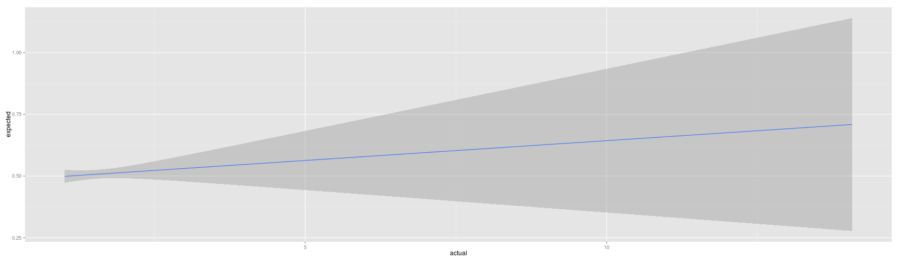
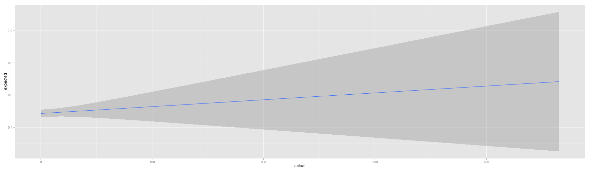
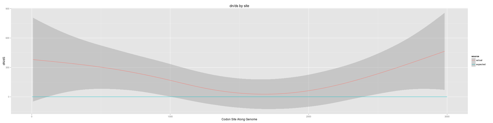
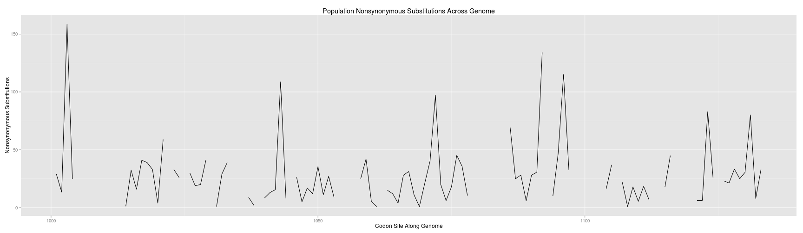
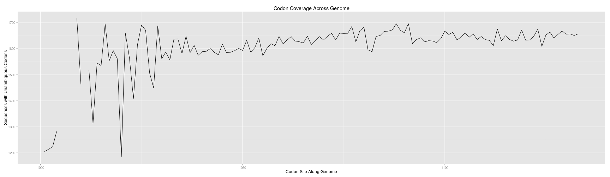
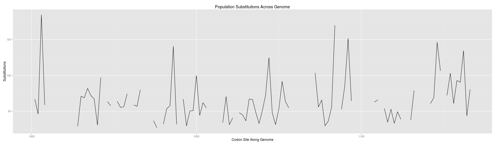
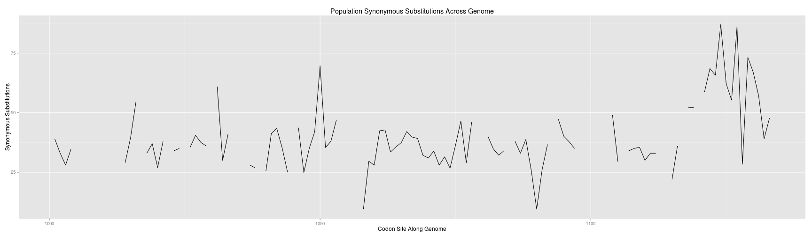
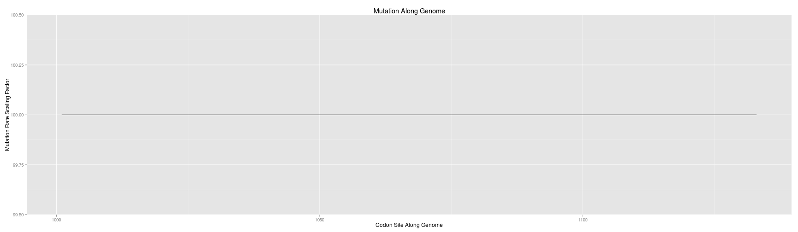

```r
library(limma)
library(ggplot2)
library(reshape2)

INDELIBLE_RATES_OUTPUT_COMMENT_LINES <- 10
ACTUAL_DNDS_COMMENT_LINES <- 0

actual_dnds <- read.table("../data/out/consensus/actual_dnds_by_site.tsv", header = TRUE, 
    na.strings = "None", skip = ACTUAL_DNDS_COMMENT_LINES)
dim(actual_dnds)
```

```
## [1] 3000    8
```

```r
head(actual_dnds)
```

```
##         Ref Site dNdS Windows Codons NonSyn Syn Subst
## 1 consensus    1   NA       0     NA     NA  NA    NA
## 2 consensus    2   NA       0     NA     NA  NA    NA
## 3 consensus    3   NA       0     NA     NA  NA    NA
## 4 consensus    4   NA       0     NA     NA  NA    NA
## 5 consensus    5   NA       0     NA     NA  NA    NA
## 6 consensus    6   NA       0     NA     NA  NA    NA
```

```r
tail(actual_dnds)
```

```
##            Ref Site dNdS Windows Codons NonSyn Syn Subst
## 2995 consensus 2995   NA       0     NA     NA  NA    NA
## 2996 consensus 2996   NA       0     NA     NA  NA    NA
## 2997 consensus 2997   NA       0     NA     NA  NA    NA
## 2998 consensus 2998   NA       0     NA     NA  NA    NA
## 2999 consensus 2999   NA       0     NA     NA  NA    NA
## 3000 consensus 3000   NA       0     NA     NA  NA    NA
```

```r
str(actual_dnds)
```

```
## 'data.frame':	3000 obs. of  8 variables:
##  $ Ref    : Factor w/ 1 level "consensus": 1 1 1 1 1 1 1 1 1 1 ...
##  $ Site   : int  1 2 3 4 5 6 7 8 9 10 ...
##  $ dNdS   : num  NA NA NA NA NA NA NA NA NA NA ...
##  $ Windows: int  0 0 0 0 0 0 0 0 0 0 ...
##  $ Codons : num  NA NA NA NA NA NA NA NA NA NA ...
##  $ NonSyn : num  NA NA NA NA NA NA NA NA NA NA ...
##  $ Syn    : num  NA NA NA NA NA NA NA NA NA NA ...
##  $ Subst  : num  NA NA NA NA NA NA NA NA NA NA ...
```

```r
summary(actual_dnds)
```

```
##         Ref            Site           dNdS         Windows     
##  consensus:3000   Min.   :   1   Min.   : 1.0   Min.   : 0.00  
##                   1st Qu.: 751   1st Qu.: 1.3   1st Qu.: 0.00  
##                   Median :1500   Median : 1.4   Median : 1.00  
##                   Mean   :1500   Mean   : 1.6   Mean   : 2.03  
##                   3rd Qu.:2250   3rd Qu.: 1.6   3rd Qu.: 3.00  
##                   Max.   :3000   Max.   :14.1   Max.   :25.00  
##                                  NA's   :943                   
##      Codons        NonSyn          Syn            Subst       
##  Min.   :277   Min.   :  16   Min.   :  0.4   Min.   :  16.3  
##  1st Qu.:386   1st Qu.: 230   1st Qu.: 58.8   1st Qu.: 287.8  
##  Median :814   Median : 310   Median : 93.2   Median : 404.1  
##  Mean   :685   Mean   : 320   Mean   : 95.2   Mean   : 414.9  
##  3rd Qu.:860   3rd Qu.: 388   3rd Qu.:126.3   3rd Qu.: 509.2  
##  Max.   :929   Max.   :2064   Max.   :618.7   Max.   :2508.2  
##  NA's   :943   NA's   :943    NA's   :943     NA's   :943
```

```r
# Convert NA Codons to zero
actual_dnds$Codons[is.na(actual_dnds$Codons)] <- 0
actual_dnds$NonSyn[is.na(actual_dnds$NonSyn)] <- 0
actual_dnds$Syn[is.na(actual_dnds$Syn)] <- 0
actual_dnds$Subst[is.na(actual_dnds$Subst)] <- 0
summary(actual_dnds)
```

```
##         Ref            Site           dNdS         Windows     
##  consensus:3000   Min.   :   1   Min.   : 1.0   Min.   : 0.00  
##                   1st Qu.: 751   1st Qu.: 1.3   1st Qu.: 0.00  
##                   Median :1500   Median : 1.4   Median : 1.00  
##                   Mean   :1500   Mean   : 1.6   Mean   : 2.03  
##                   3rd Qu.:2250   3rd Qu.: 1.6   3rd Qu.: 3.00  
##                   Max.   :3000   Max.   :14.1   Max.   :25.00  
##                                  NA's   :943                   
##      Codons        NonSyn          Syn            Subst     
##  Min.   :  0   Min.   :   0   Min.   :  0.0   Min.   :   0  
##  1st Qu.:  0   1st Qu.:   0   1st Qu.:  0.0   1st Qu.:   0  
##  Median :394   Median : 237   Median : 61.9   Median : 301  
##  Mean   :470   Mean   : 219   Mean   : 65.3   Mean   : 284  
##  3rd Qu.:840   3rd Qu.: 348   3rd Qu.:109.3   3rd Qu.: 457  
##  Max.   :929   Max.   :2064   Max.   :618.7   Max.   :2508  
## 
```

```r

expected_dnds <- read.table("../data/sample_genomes.rates", header = TRUE, sep = ",")
dim(expected_dnds)
```

```
## [1] 3000    6
```

```r
head(expected_dnds)
```

```
##   Site OldSite Interval Scaling_factor Rate_class Omega
## 1    1       1        0              1          1  0.15
## 2    2       2        0              1          3  0.35
## 3    3       3        0              1          4  0.45
## 4    4       4        0              1          4  0.45
## 5    5       5        0              1          7  0.75
## 6    6       6        0              1          0  0.05
```

```r
str(expected_dnds)
```

```
## 'data.frame':	3000 obs. of  6 variables:
##  $ Site          : int  1 2 3 4 5 6 7 8 9 10 ...
##  $ OldSite       : int  1 2 3 4 5 6 7 8 9 10 ...
##  $ Interval      : int  0 0 0 0 0 0 0 0 0 0 ...
##  $ Scaling_factor: num  1 1 1 1 1 1 1 1 1 1 ...
##  $ Rate_class    : int  1 3 4 4 7 0 3 7 2 3 ...
##  $ Omega         : num  0.15 0.35 0.45 0.45 0.75 0.05 0.35 0.75 0.25 0.35 ...
```

```r
summary(expected_dnds)
```

```
##       Site         OldSite        Interval Scaling_factor    Rate_class   
##  Min.   :   1   Min.   :   1   Min.   :0   Min.   :  1.0   Min.   : 0.00  
##  1st Qu.: 751   1st Qu.: 751   1st Qu.:3   1st Qu.:  5.0   1st Qu.: 1.00  
##  Median :1500   Median :1500   Median :4   Median : 10.0   Median : 3.00  
##  Mean   :1500   Mean   :1500   Mean   :4   Mean   : 37.7   Mean   : 4.43  
##  3rd Qu.:2250   3rd Qu.:2250   3rd Qu.:5   3rd Qu.:100.0   3rd Qu.: 6.00  
##  Max.   :3000   Max.   :3000   Max.   :8   Max.   :100.0   Max.   :27.00  
##      Omega      
##  Min.   :0.050  
##  1st Qu.:0.150  
##  Median :0.350  
##  Mean   :0.493  
##  3rd Qu.:0.650  
##  Max.   :2.750
```

```r


# orig_dnds <- read.table('../data/sample_genomes.rates.orig', header=TRUE,
# sep=',') dim(orig_dnds) head(orig_dnds) str(orig_dnds) summary(orig_dnds)
# all(orig_dnds$omega == expected_dnds$Omega) sum(orig_dnds$omega ==
# expected_dnds$Omega)
```


**Paired test without assumption of normalcy**


```r
htest <- wilcox.test(actual_dnds$dNdS, expected_dnds$Omega, paired = TRUE, exact = TRUE, 
    na.action = "na.exclude")
print(htest)
```

```
## 
## 	Wilcoxon signed rank test
## 
## data:  actual_dnds$dNdS and expected_dnds$Omega
## V = 2098252, p-value < 2.2e-16
## alternative hypothesis: true location shift is not equal to 0
```


**Scatterplot actual vs expected dn ds together**


```r
fullDat <- data.frame(site = expected_dnds$Site, actual = actual_dnds$dNdS, 
    expected = expected_dnds$Omega)
head(fullDat[!is.na(fullDat$actual), ])
```

```
##    site actual expected
## 29   29 14.071     0.25
## 33   33  5.493     0.15
## 45   45  4.713     0.25
## 46   46  2.991     0.35
## 49   49  3.379     0.55
## 53   53  6.331     0.65
```

```r
ggplot(fullDat, aes(x = actual, y = expected)) + geom_smooth(method = lm)
```

```
## Warning: Removed 943 rows containing missing values (stat_smooth).
```

 


**Scatterplot the dn/ds across the genome**


```r
fullDatBySource <- reshape2:::melt.data.frame(data = fullDat, na.rm = TRUE, 
    id.vars = "site", variable.name = "source", value.name = "dnds")
head(fullDatBySource)
```

```
##    site source   dnds
## 29   29 actual 14.071
## 33   33 actual  5.493
## 45   45 actual  4.713
## 46   46 actual  2.991
## 49   49 actual  3.379
## 53   53 actual  6.331
```

```r
tail(fullDatBySource)
```

```
##      site   source dnds
## 5995 2995 expected 0.95
## 5996 2996 expected 0.55
## 5997 2997 expected 0.45
## 5998 2998 expected 0.05
## 5999 2999 expected 0.45
## 6000 3000 expected 0.15
```

```r
str(fullDatBySource)
```

```
## 'data.frame':	5057 obs. of  3 variables:
##  $ site  : int  29 33 45 46 49 53 57 59 60 61 ...
##  $ source: Factor w/ 2 levels "actual","expected": 1 1 1 1 1 1 1 1 1 1 ...
##  $ dnds  : num  14.07 5.49 4.71 2.99 3.38 ...
```

```r
summary(fullDatBySource)
```

```
##       site           source          dnds       
##  Min.   :   1   actual  :2057   Min.   : 0.050  
##  1st Qu.: 740   expected:3000   1st Qu.: 0.350  
##  Median :1478                   Median : 0.850  
##  Mean   :1484                   Mean   : 0.927  
##  3rd Qu.:2244                   3rd Qu.: 1.408  
##  Max.   :3000                   Max.   :14.071
```

```r
ggplot(fullDatBySource, aes(x = site, y = dnds, color = source)) + geom_smooth() + 
    xlab("Codon Site Along Genome") + ylab("dN/dS") + ggtitle("dn/ds by site")
```

```
## geom_smooth: method="auto" and size of largest group is >=1000, so using gam with formula: y ~ s(x, bs = "cs"). Use 'method = x' to change the smoothing method.
```

 


**Plot the unambiguous codon depth across genome**


```r
ggplot(actual_dnds, aes(x = Site, y = Codons)) + geom_line() + xlab("Codon Site Along Genome") + 
    ylab("Sequences with Unambiguous Codons") + ggtitle("Population Unambiguous Codons Across Genome")
```

 


**Plot the nonsynonymous substitutions across genome**


```r
ggplot(actual_dnds, aes(x = Site, y = NonSyn)) + geom_line() + xlab("Codon Site Along Genome") + 
    ylab("Nonsynonymous Substitutions") + ggtitle("Population Nonsynonymous Substitutions Across Genome")
```

 


**Plot the synonymous substitutions across genome**


```r
ggplot(actual_dnds, aes(x = Site, y = Syn)) + geom_line() + xlab("Codon Site Along Genome") + 
    ylab("Synonymous Substitutions") + ggtitle("Population Synonymous Substitutions Across Genome")
```

 


**Plot the substitutions across genome**


```r
ggplot(actual_dnds, aes(x = Site, y = Subst)) + geom_line() + xlab("Codon Site Along Genome") + 
    ylab("Substitutions") + ggtitle("Population Substitutions Across Genome")
```

 


**Plot the expected mutation rate across the genome**


```r
ggplot(expected_dnds, aes(x = Site, y = Scaling_factor)) + geom_line() + xlab("Codon Site Along Genome") + 
    ylab("Mutation Rate Scaling Factor") + ggtitle("Mutation Along Genome")
```

 


**Plot the Expected Omega rate across the genome**


```r
ggplot(expected_dnds, aes(x = Site, y = Omega)) + geom_line() + xlab("Codon Site Along Genome") + 
    ylab("dn/dS Expected") + ggtitle("Expected Selection Along Genome")
```

 

```r
# dnds_cor <- cor(log(actual_dnds$dNdS), expected_dnds$Omega,
# method='spearman', use='pairwise.complete.obs')
dnds_cor <- cor(actual_dnds$dNdS, expected_dnds$Omega, method = "spearman", 
    use = "complete.obs")
print(dnds_cor)
```

```
## [1] 0.0169
```


