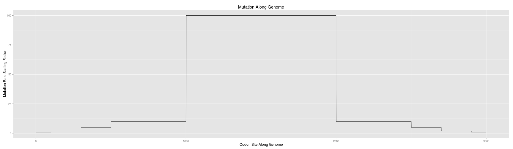

```r
library(limma)
library(ggplot2)
library(reshape2)

INDELIBLE_RATES_OUTPUT_COMMENT_LINES <- 10
ACTUAL_DNDS_COMMENT_LINES <- 0
```


**Windowsize = 400, ref=consensus,ref_len=9000,sam=./simulations/data/sample_genomes.grinder-reads.rename.sam,mapping qual cutoff=10,read qual cutoff=10,max fraction N=0.25,start nuc pos=1,end nuc pos=9000,window depth=50**
-----------------------------


```r
actual_dnds <- read.table("../data/out/consensus/bugaboo/actual_dnds_by_site.tsv", 
    header = TRUE, na.strings = "None", skip = ACTUAL_DNDS_COMMENT_LINES)
dim(actual_dnds)
```

```
## [1] 3000    8
```

```r
head(actual_dnds)
```

```
##         Ref Site dNdS Windows Codons NonSyn Syn Subst
## 1 consensus    1   NA       0     NA     NA  NA    NA
## 2 consensus    2   NA       0     NA     NA  NA    NA
## 3 consensus    3   NA       0     NA     NA  NA    NA
## 4 consensus    4   NA       0     NA     NA  NA    NA
## 5 consensus    5   NA       0     NA     NA  NA    NA
## 6 consensus    6   NA       0     NA     NA  NA    NA
```

```r
tail(actual_dnds)
```

```
##            Ref Site dNdS Windows Codons NonSyn Syn Subst
## 2995 consensus 2995   NA       0     NA     NA  NA    NA
## 2996 consensus 2996   NA       0     NA     NA  NA    NA
## 2997 consensus 2997   NA       0     NA     NA  NA    NA
## 2998 consensus 2998   NA       0     NA     NA  NA    NA
## 2999 consensus 2999   NA       0     NA     NA  NA    NA
## 3000 consensus 3000   NA       0     NA     NA  NA    NA
```

```r
str(actual_dnds)
```

```
## 'data.frame':	3000 obs. of  8 variables:
##  $ Ref    : Factor w/ 1 level "consensus": 1 1 1 1 1 1 1 1 1 1 ...
##  $ Site   : int  1 2 3 4 5 6 7 8 9 10 ...
##  $ dNdS   : num  NA NA NA NA NA NA NA NA NA NA ...
##  $ Windows: int  0 0 0 0 0 0 0 0 0 0 ...
##  $ Codons : num  NA NA NA NA NA NA NA NA NA NA ...
##  $ NonSyn : num  NA NA NA NA NA NA NA NA NA NA ...
##  $ Syn    : num  NA NA NA NA NA NA NA NA NA NA ...
##  $ Subst  : num  NA NA NA NA NA NA NA NA NA NA ...
```

```r
summary(actual_dnds)
```

```
##         Ref            Site           dNdS          Windows    
##  consensus:3000   Min.   :   1   Min.   :  1.2   Min.   : 0.0  
##                   1st Qu.: 751   1st Qu.:  1.4   1st Qu.: 1.0  
##                   Median :1500   Median :  1.6   Median : 3.0  
##                   Mean   :1500   Mean   :  2.8   Mean   : 4.1  
##                   3rd Qu.:2250   3rd Qu.:  2.2   3rd Qu.: 5.0  
##                   Max.   :3000   Max.   :444.2   Max.   :33.0  
##                                  NA's   :479                   
##      Codons        NonSyn           Syn            Subst       
##  Min.   :204   Min.   : 12.3   Min.   :  0.0   Min.   :  13.3  
##  1st Qu.:341   1st Qu.:131.4   1st Qu.: 31.2   1st Qu.: 163.6  
##  Median :606   Median :216.7   Median : 63.2   Median : 280.7  
##  Mean   :535   Mean   :226.9   Mean   : 68.3   Mean   : 295.1  
##  3rd Qu.:668   3rd Qu.:315.6   3rd Qu.: 98.8   3rd Qu.: 414.1  
##  Max.   :802   Max.   :767.4   Max.   :291.6   Max.   :1008.9  
##  NA's   :479   NA's   :479     NA's   :479     NA's   :479
```

```r
# Convert NA Codons to zero
actual_dnds$Codons[is.na(actual_dnds$Codons)] <- 0
actual_dnds$NonSyn[is.na(actual_dnds$NonSyn)] <- 0
actual_dnds$Syn[is.na(actual_dnds$Syn)] <- 0
actual_dnds$Subst[is.na(actual_dnds$Subst)] <- 0
summary(actual_dnds)
```

```
##         Ref            Site           dNdS          Windows    
##  consensus:3000   Min.   :   1   Min.   :  1.2   Min.   : 0.0  
##                   1st Qu.: 751   1st Qu.:  1.4   1st Qu.: 1.0  
##                   Median :1500   Median :  1.6   Median : 3.0  
##                   Mean   :1500   Mean   :  2.8   Mean   : 4.1  
##                   3rd Qu.:2250   3rd Qu.:  2.2   3rd Qu.: 5.0  
##                   Max.   :3000   Max.   :444.2   Max.   :33.0  
##                                  NA's   :479                   
##      Codons        NonSyn           Syn            Subst       
##  Min.   :  0   Min.   :  0.0   Min.   :  0.0   Min.   :   0.0  
##  1st Qu.:306   1st Qu.: 74.2   1st Qu.: 15.0   1st Qu.:  89.2  
##  Median :559   Median :183.5   Median : 51.2   Median : 234.9  
##  Mean   :450   Mean   :190.6   Mean   : 57.4   Mean   : 248.0  
##  3rd Qu.:659   3rd Qu.:296.3   3rd Qu.: 92.1   3rd Qu.: 388.6  
##  Max.   :802   Max.   :767.4   Max.   :291.6   Max.   :1008.9  
## 
```

```r

expected_dnds <- read.table("../data/sample_genomes.rates", header = TRUE, sep = ",")
dim(expected_dnds)
```

```
## [1] 3000    5
```

```r
head(expected_dnds)
```

```
##   Site Interval Scaling_factor Rate_class Omega
## 1    1        0              1          1  0.15
## 2    2        0              1          3  0.35
## 3    3        0              1          4  0.45
## 4    4        0              1          4  0.45
## 5    5        0              1          7  0.75
## 6    6        0              1          0  0.05
```

```r
str(expected_dnds)
```

```
## 'data.frame':	3000 obs. of  5 variables:
##  $ Site          : int  1 2 3 4 5 6 7 8 9 10 ...
##  $ Interval      : int  0 0 0 0 0 0 0 0 0 0 ...
##  $ Scaling_factor: num  1 1 1 1 1 1 1 1 1 1 ...
##  $ Rate_class    : int  1 3 4 4 7 0 3 7 2 3 ...
##  $ Omega         : num  0.15 0.35 0.45 0.45 0.75 0.05 0.35 0.75 0.25 0.35 ...
```

```r
summary(expected_dnds)
```

```
##       Site         Interval Scaling_factor    Rate_class   
##  Min.   :   1   Min.   :0   Min.   :  1.0   Min.   : 0.00  
##  1st Qu.: 751   1st Qu.:3   1st Qu.:  5.0   1st Qu.: 1.00  
##  Median :1500   Median :4   Median : 10.0   Median : 3.00  
##  Mean   :1500   Mean   :4   Mean   : 37.7   Mean   : 4.43  
##  3rd Qu.:2250   3rd Qu.:5   3rd Qu.:100.0   3rd Qu.: 6.00  
##  Max.   :3000   Max.   :8   Max.   :100.0   Max.   :27.00  
##      Omega      
##  Min.   :0.050  
##  1st Qu.:0.150  
##  Median :0.350  
##  Mean   :0.493  
##  3rd Qu.:0.650  
##  Max.   :2.750
```

```r


# orig_dnds <- read.table('../data/sample_genomes.rates.orig', header=TRUE,
# sep=',') dim(orig_dnds) head(orig_dnds) str(orig_dnds) summary(orig_dnds)
# all(orig_dnds$omega == expected_dnds$Omega) sum(orig_dnds$omega ==
# expected_dnds$Omega)
```


**Paired test without assumption of normalcy**


```r
htest <- wilcox.test(actual_dnds$dNdS, expected_dnds$Omega, paired = TRUE, exact = TRUE, 
    na.action = "na.exclude")
print(htest)
```

```
## 
## 	Wilcoxon signed rank test
## 
## data:  actual_dnds$dNdS and expected_dnds$Omega
## V = 3169110, p-value < 2.2e-16
## alternative hypothesis: true location shift is not equal to 0
```


**Scatterplot actual vs expected dn ds together**


```r
fullDat <- data.frame(site = expected_dnds$Site, actual = actual_dnds$dNdS, 
    expected = expected_dnds$Omega)
head(fullDat[!is.na(fullDat$actual), ])
```

```
##    site actual expected
## 33   33  5.626     0.15
## 42   42  4.558     0.55
## 44   44  5.388     0.05
## 45   45  4.315     0.25
## 46   46  3.225     0.35
## 48   48  4.173     0.55
```

```r
ggplot(fullDat, aes(x = actual, y = expected)) + geom_smooth(method = lm)
```

```
## Warning: Removed 479 rows containing missing values (stat_smooth).
```

 


**Scatterplot the dn/ds across the genome**


```r
fullDatBySource <- reshape2:::melt.data.frame(data = fullDat, na.rm = TRUE, 
    id.vars = "site", variable.name = "source", value.name = "dnds")
head(fullDatBySource)
```

```
##    site source  dnds
## 33   33 actual 5.626
## 42   42 actual 4.558
## 44   44 actual 5.388
## 45   45 actual 4.315
## 46   46 actual 3.225
## 48   48 actual 4.173
```

```r
tail(fullDatBySource)
```

```
##      site   source dnds
## 5995 2995 expected 0.95
## 5996 2996 expected 0.55
## 5997 2997 expected 0.45
## 5998 2998 expected 0.05
## 5999 2999 expected 0.45
## 6000 3000 expected 0.15
```

```r
str(fullDatBySource)
```

```
## 'data.frame':	5521 obs. of  3 variables:
##  $ site  : int  33 42 44 45 46 48 49 50 53 57 ...
##  $ source: Factor w/ 2 levels "actual","expected": 1 1 1 1 1 1 1 1 1 1 ...
##  $ dnds  : num  5.63 4.56 5.39 4.31 3.23 ...
```

```r
summary(fullDatBySource)
```

```
##       site           source          dnds      
##  Min.   :   1   actual  :2521   Min.   :  0.0  
##  1st Qu.: 767   expected:3000   1st Qu.:  0.4  
##  Median :1482                   Median :  1.1  
##  Mean   :1486                   Mean   :  1.5  
##  3rd Qu.:2212                   3rd Qu.:  1.6  
##  Max.   :3000                   Max.   :444.2
```

```r
ggplot(fullDatBySource, aes(x = site, y = dnds, color = source)) + geom_smooth() + 
    xlab("Codon Site Along Genome") + ylab("dN/dS") + ggtitle("dn/ds by site")
```

```
## geom_smooth: method="auto" and size of largest group is >=1000, so using gam with formula: y ~ s(x, bs = "cs"). Use 'method = x' to change the smoothing method.
```

 


**Plot the unambiguous codon depth across genome**


```r
ggplot(actual_dnds, aes(x = Site, y = Codons)) + geom_line() + xlab("Codon Site Along Genome") + 
    ylab("Sequences with Unambiguous Codons") + ggtitle("Population Unambiguous Codons Across Genome")
```

 


**Plot the nonsynonymous substitutions across genome**


```r
ggplot(actual_dnds, aes(x = Site, y = NonSyn)) + geom_line() + xlab("Codon Site Along Genome") + 
    ylab("Nonsynonymous Substitutions") + ggtitle("Population Nonsynonymous Substitutions Across Genome")
```

 


**Plot the synonymous substitutions across genome**


```r
ggplot(actual_dnds, aes(x = Site, y = Syn)) + geom_line() + xlab("Codon Site Along Genome") + 
    ylab("Synonymous Substitutions") + ggtitle("Population Synonymous Substitutions Across Genome")
```

 


**Plot the substitutions across genome**


```r
ggplot(actual_dnds, aes(x = Site, y = Subst)) + geom_line() + xlab("Codon Site Along Genome") + 
    ylab("Substitutions") + ggtitle("Population Substitutions Across Genome")
```

 


**Plot the expected mutation rate across the genome**


```r
ggplot(expected_dnds, aes(x = Site, y = Scaling_factor)) + geom_line() + xlab("Codon Site Along Genome") + 
    ylab("Mutation Rate Scaling Factor") + ggtitle("Mutation Along Genome")
```

 


**Plot the Expected Omega rate across the genome**


```r
ggplot(expected_dnds, aes(x = Site, y = Omega)) + geom_line() + xlab("Codon Site Along Genome") + 
    ylab("dn/dS Expected") + ggtitle("Expected Selection Along Genome")
```

 

```r
# dnds_cor <- cor(log(actual_dnds$dNdS), expected_dnds$Omega,
# method='spearman', use='pairwise.complete.obs')
dnds_cor <- cor(actual_dnds$dNdS, expected_dnds$Omega, method = "spearman", 
    use = "complete.obs")
print(dnds_cor)
```

```
## [1] 0.04211
```


