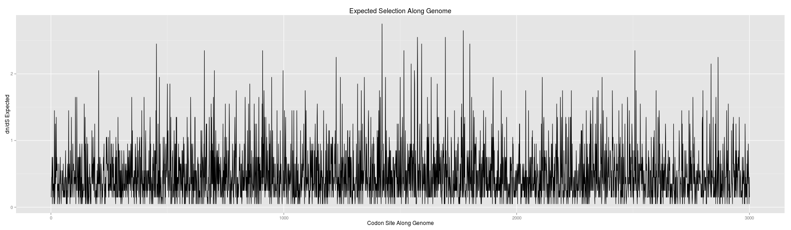
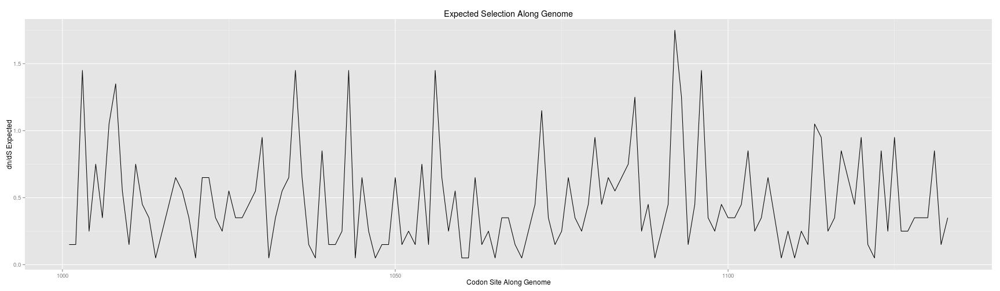

```r
library(limma)
```

```
## Loading required package: methods
```

```r
library(ggplot2)
library(reshape2)
library(knitr)

NUC_PER_CODON <- 3
WINDOWSIZE <- 400
REF_LEN_NUC <- 9000

POPN_SIZE <- 10000
START_NUCPOS <- 3001
END_NUCPOS <- 3400

START_CODON <- 1001
END_CODON <- 1133

actual_dnds_filename <- "../data/out/consensus/mut100_1x_errfree_window400/actual_dnds_by_site.tsv"
dnds_file <- file(actual_dnds_filename, open = "rt")
comments <- readLines(dnds_file, 1)  # Read one line 
close(dnds_file)
```


**# ref=consensus,ref_len=9000,sam=./simulations/data/indelible/cov1x/sample_genomes.100.1x.errfree.consensus.sam,mapping qual cutoff=20,read qual cutoff=20,max fraction N=0.1,start nuc pos=3001,end nuc pos=3004,windowsize=400,window depth thresh=50,window breadth fraction=0.875,pvalue=0.05**
-----------------------------


```r
actual_dnds <- read.table(actual_dnds_filename, header = TRUE, na.strings = "None", 
    comment.char = "#")
dim(actual_dnds)
```

```
## [1] 3000    9
```

```r
head(actual_dnds)
```

```
##         Ref Site dNdS dN_minus_dS Windows Codons NonSyn Syn Subst
## 1 consensus    1   NA          NA       0     NA     NA  NA    NA
## 2 consensus    2   NA          NA       0     NA     NA  NA    NA
## 3 consensus    3   NA          NA       0     NA     NA  NA    NA
## 4 consensus    4   NA          NA       0     NA     NA  NA    NA
## 5 consensus    5   NA          NA       0     NA     NA  NA    NA
## 6 consensus    6   NA          NA       0     NA     NA  NA    NA
```

```r
tail(actual_dnds)
```

```
##            Ref Site dNdS dN_minus_dS Windows Codons NonSyn Syn Subst
## 2995 consensus 2995   NA          NA       0     NA     NA  NA    NA
## 2996 consensus 2996   NA          NA       0     NA     NA  NA    NA
## 2997 consensus 2997   NA          NA       0     NA     NA  NA    NA
## 2998 consensus 2998   NA          NA       0     NA     NA  NA    NA
## 2999 consensus 2999   NA          NA       0     NA     NA  NA    NA
## 3000 consensus 3000   NA          NA       0     NA     NA  NA    NA
```

```r
str(actual_dnds)
```

```
## 'data.frame':	3000 obs. of  9 variables:
##  $ Ref        : Factor w/ 1 level "consensus": 1 1 1 1 1 1 1 1 1 1 ...
##  $ Site       : int  1 2 3 4 5 6 7 8 9 10 ...
##  $ dNdS       : num  NA NA NA NA NA NA NA NA NA NA ...
##  $ dN_minus_dS: num  NA NA NA NA NA NA NA NA NA NA ...
##  $ Windows    : int  0 0 0 0 0 0 0 0 0 0 ...
##  $ Codons     : num  NA NA NA NA NA NA NA NA NA NA ...
##  $ NonSyn     : num  NA NA NA NA NA NA NA NA NA NA ...
##  $ Syn        : num  NA NA NA NA NA NA NA NA NA NA ...
##  $ Subst      : num  NA NA NA NA NA NA NA NA NA NA ...
```

```r
summary(actual_dnds)
```

```
##         Ref            Site           dNdS       dN_minus_dS  
##  consensus:3000   Min.   :   1   Min.   :0.0    Min.   :-3.6  
##                   1st Qu.: 751   1st Qu.:0.2    1st Qu.:-1.4  
##                   Median :1500   Median :0.3    Median :-1.1  
##                   Mean   :1500   Mean   :0.4    Mean   :-1.1  
##                   3rd Qu.:2250   3rd Qu.:0.5    3rd Qu.:-0.8  
##                   Max.   :3000   Max.   :2.4    Max.   : 2.2  
##                                  NA's   :2898   NA's   :2898  
##     Windows          Codons         NonSyn           Syn      
##  Min.   :0.000   Min.   :2154   Min.   :  1.0   Min.   : 9.5  
##  1st Qu.:0.000   1st Qu.:3808   1st Qu.: 12.7   1st Qu.:32.1  
##  Median :0.000   Median :3817   Median : 26.9   Median :36.0  
##  Mean   :0.066   Mean   :3613   Mean   : 33.8   Mean   :39.2  
##  3rd Qu.:0.000   3rd Qu.:3831   3rd Qu.: 42.6   3rd Qu.:42.3  
##  Max.   :2.000   Max.   :3842   Max.   :176.9   Max.   :87.0  
##                  NA's   :2898   NA's   :2898    NA's   :2898  
##      Subst      
##  Min.   : 28.8  
##  1st Qu.: 51.3  
##  Median : 65.6  
##  Mean   : 73.0  
##  3rd Qu.: 83.2  
##  Max.   :204.9  
##  NA's   :2898
```

```r


expected_dnds <- read.table("../data/indelible/sample_genomes.100.rates.csv", 
    header = TRUE, sep = ",")
dim(expected_dnds)
```

```
## [1] 3000    5
```

```r
head(expected_dnds)
```

```
##   Site Interval Scaling_factor Rate_class Omega
## 1    1        0            100          5  0.55
## 2    2        0            100          1  0.15
## 3    3        0            100         20  2.05
## 4    4        0            100         14  1.45
## 5    5        0            100          2  0.25
## 6    6        0            100          0  0.05
```

```r
str(expected_dnds)
```

```
## 'data.frame':	3000 obs. of  5 variables:
##  $ Site          : int  1 2 3 4 5 6 7 8 9 10 ...
##  $ Interval      : int  0 0 0 0 0 0 0 0 0 0 ...
##  $ Scaling_factor: num  100 100 100 100 100 100 100 100 100 100 ...
##  $ Rate_class    : int  5 1 20 14 2 0 1 2 3 3 ...
##  $ Omega         : num  0.55 0.15 2.05 1.45 0.25 0.05 0.15 0.25 0.35 0.35 ...
```

```r
summary(expected_dnds)
```

```
##       Site         Interval Scaling_factor   Rate_class        Omega      
##  Min.   :   1   Min.   :0   Min.   :100    Min.   : 0.00   Min.   :0.050  
##  1st Qu.: 751   1st Qu.:0   1st Qu.:100    1st Qu.: 1.00   1st Qu.:0.150  
##  Median :1500   Median :0   Median :100    Median : 3.00   Median :0.350  
##  Mean   :1500   Mean   :0   Mean   :100    Mean   : 4.56   Mean   :0.506  
##  3rd Qu.:2250   3rd Qu.:0   3rd Qu.:100    3rd Qu.: 6.00   3rd Qu.:0.650  
##  Max.   :3000   Max.   :0   Max.   :100    Max.   :33.00   Max.   :3.350
```

```r

all(expected_dnds$Site == actual_dnds$Site)
```

```
## [1] TRUE
```

```r
actual_dnds <- actual_dnds[START_CODON:END_CODON, ]
summary(actual_dnds)
```

```
##         Ref           Site           dNdS        dN_minus_dS    
##  consensus:133   Min.   :1001   Min.   :0.014   Min.   :-3.650  
##                  1st Qu.:1034   1st Qu.:0.152   1st Qu.:-1.389  
##                  Median :1067   Median :0.291   Median :-1.140  
##                  Mean   :1067   Mean   :0.419   Mean   :-1.052  
##                  3rd Qu.:1100   3rd Qu.:0.511   3rd Qu.:-0.832  
##                  Max.   :1133   Max.   :2.421   Max.   : 2.206  
##                                 NA's   :31      NA's   :31      
##     Windows         Codons         NonSyn           Syn      
##  Min.   :0.00   Min.   :2154   Min.   :  1.0   Min.   : 9.5  
##  1st Qu.:1.00   1st Qu.:3808   1st Qu.: 12.7   1st Qu.:32.1  
##  Median :2.00   Median :3817   Median : 26.9   Median :36.0  
##  Mean   :1.49   Mean   :3613   Mean   : 33.8   Mean   :39.2  
##  3rd Qu.:2.00   3rd Qu.:3831   3rd Qu.: 42.6   3rd Qu.:42.3  
##  Max.   :2.00   Max.   :3842   Max.   :176.9   Max.   :87.0  
##                 NA's   :31     NA's   :31      NA's   :31    
##      Subst      
##  Min.   : 28.8  
##  1st Qu.: 51.3  
##  Median : 65.6  
##  Mean   : 73.0  
##  3rd Qu.: 83.2  
##  Max.   :204.9  
##  NA's   :31
```

```r
expected_dnds <- expected_dnds[START_CODON:END_CODON, ]
summary(expected_dnds)
```

```
##       Site         Interval Scaling_factor   Rate_class       Omega      
##  Min.   :1001   Min.   :0   Min.   :100    Min.   : 0.0   Min.   :0.050  
##  1st Qu.:1034   1st Qu.:0   1st Qu.:100    1st Qu.: 2.0   1st Qu.:0.250  
##  Median :1067   Median :0   Median :100    Median : 3.0   Median :0.350  
##  Mean   :1067   Mean   :0   Mean   :100    Mean   : 4.2   Mean   :0.469  
##  3rd Qu.:1100   3rd Qu.:0   3rd Qu.:100    3rd Qu.: 6.0   3rd Qu.:0.650  
##  Max.   :1133   Max.   :0   Max.   :100    Max.   :17.0   Max.   :1.750
```

```r


# check consistency
all(expected_dnds$Site == actual_dnds$Site)
```

```
## [1] TRUE
```


**Scatterplot actual vs expected dn ds together**


```r
fullDat <- data.frame(Site = expected_dnds$Site, Expected = expected_dnds$Omega, 
    Inferred = actual_dnds$dNdS)
head(fullDat[!is.na(fullDat$Inferred), ])
```

```
##    Site Expected Inferred
## 1  1001     0.15   0.3894
## 2  1002     0.15   0.2099
## 3  1003     1.45   2.4206
## 4  1004     0.25   0.4489
## 8  1008     1.35   1.5603
## 10 1010     0.15   0.2640
```

```r
fullDatNoNA <- fullDat[!is.na(fullDat$Inferred), ]


ggplot(fullDatNoNA, aes(x = Inferred, y = Expected)) + geom_smooth(method = lm, 
    size = 4, color = "#A30052", fill = "#FF99CC") + xlab("\nInferred") + ylab("Expected\n") + 
    theme(axis.title = element_text(size = 32), axis.text = element_text(size = 24)) + 
    scale_x_continuous(breaks = seq(0, 3, 0.5), limits = c(0, max(fullDatNoNA$Inferred))) + 
    scale_y_continuous(breaks = seq(0, 3, 0.5), limits = c(0, max(fullDatNoNA$Expected))) + 
    coord_fixed(ratio = 1) + ggtitle("Inferred vs Expected dn/ds")
```

```
## Warning: Removed 8 rows containing missing values (geom_path).
```

 


**Smoothed Scatterplot of dn/ds across the genome**


```r
fullDatBySource <- reshape2:::melt.data.frame(data = fullDat, na.rm = FALSE, 
    id.vars = "Site", measure.vars = c("Expected", "Inferred"), variable.name = "source", 
    value.name = "dnds")
head(fullDatBySource)
```

```
##   Site   source dnds
## 1 1001 Expected 0.15
## 2 1002 Expected 0.15
## 3 1003 Expected 1.45
## 4 1004 Expected 0.25
## 5 1005 Expected 0.75
## 6 1006 Expected 0.35
```

```r
tail(fullDatBySource)
```

```
##     Site   source   dnds
## 261 1128 Inferred 0.4700
## 262 1129 Inferred 0.1725
## 263 1130 Inferred 0.2399
## 264 1131 Inferred 0.6176
## 265 1132 Inferred 0.1123
## 266 1133 Inferred 0.2685
```

```r
str(fullDatBySource)
```

```
## 'data.frame':	266 obs. of  3 variables:
##  $ Site  : int  1001 1002 1003 1004 1005 1006 1007 1008 1009 1010 ...
##  $ source: Factor w/ 2 levels "Expected","Inferred": 1 1 1 1 1 1 1 1 1 1 ...
##  $ dnds  : num  0.15 0.15 1.45 0.25 0.75 0.35 1.05 1.35 0.55 0.15 ...
```

```r
summary(fullDatBySource)
```

```
##       Site           source         dnds      
##  Min.   :1001   Expected:133   Min.   :0.014  
##  1st Qu.:1034   Inferred:133   1st Qu.:0.166  
##  Median :1067                  Median :0.350  
##  Mean   :1067                  Mean   :0.447  
##  3rd Qu.:1100                  3rd Qu.:0.593  
##  Max.   :1133                  Max.   :2.421  
##                                NA's   :31
```

```r
ggplot(fullDatBySource, aes(x = Site, y = dnds, color = source)) + geom_smooth() + 
    xlab("Codon Site") + ylab("dN/dS") + ggtitle("dn/ds by site")
```

```
## geom_smooth: method="auto" and size of largest group is <1000, so using loess. Use 'method = x' to change the smoothing method.
```

```
## Warning: Removed 31 rows containing missing values (stat_smooth).
```

 

```r
theme(plot.title = element_text(size = 36), axis.title = element_text(size = 32), 
    axis.text = element_text(size = 24), legend.text = element_text(size = 24), 
    legend.title = element_blank())
```

```
## List of 5
##  $ plot.title  :List of 8
##   ..$ family    : NULL
##   ..$ face      : NULL
##   ..$ colour    : NULL
##   ..$ size      : num 36
##   ..$ hjust     : NULL
##   ..$ vjust     : NULL
##   ..$ angle     : NULL
##   ..$ lineheight: NULL
##   ..- attr(*, "class")= chr [1:2] "element_text" "element"
##  $ axis.title  :List of 8
##   ..$ family    : NULL
##   ..$ face      : NULL
##   ..$ colour    : NULL
##   ..$ size      : num 32
##   ..$ hjust     : NULL
##   ..$ vjust     : NULL
##   ..$ angle     : NULL
##   ..$ lineheight: NULL
##   ..- attr(*, "class")= chr [1:2] "element_text" "element"
##  $ axis.text   :List of 8
##   ..$ family    : NULL
##   ..$ face      : NULL
##   ..$ colour    : NULL
##   ..$ size      : num 24
##   ..$ hjust     : NULL
##   ..$ vjust     : NULL
##   ..$ angle     : NULL
##   ..$ lineheight: NULL
##   ..- attr(*, "class")= chr [1:2] "element_text" "element"
##  $ legend.text :List of 8
##   ..$ family    : NULL
##   ..$ face      : NULL
##   ..$ colour    : NULL
##   ..$ size      : num 24
##   ..$ hjust     : NULL
##   ..$ vjust     : NULL
##   ..$ angle     : NULL
##   ..$ lineheight: NULL
##   ..- attr(*, "class")= chr [1:2] "element_text" "element"
##  $ legend.title: list()
##   ..- attr(*, "class")= chr [1:2] "element_blank" "element"
##  - attr(*, "class")= chr [1:2] "theme" "gg"
##  - attr(*, "complete")= logi FALSE
```


**Line Plot of dn/ds across the genome**


```r
ggplot(fullDatBySource, aes(x = Site, y = dnds, color = source)) + geom_line() + 
    xlab("Codon Site Along Genome") + ylab("dN/dS") + ggtitle("dn/ds by site")
```

 


**Point Plot of dn/ds across the genome**


```r
ggplot(fullDatBySource, aes(x = Site, y = dnds, color = source)) + geom_point() + 
    xlab("Codon Site Along Genome") + ylab("dN/dS") + ggtitle("dn/ds by site")
```

```
## Warning: Removed 31 rows containing missing values (geom_point).
```

 


**Plot the unambiguous codon depth across genome**


```r
ggplot(actual_dnds, aes(x = Site, y = Codons)) + geom_line() + xlab("Codon Site Along Genome") + 
    ylab("Sequences with Unambiguous Codons") + ggtitle("Population Unambiguous Codons Across Genome")
```

 


**Plot the nonsynonymous substitutions across genome**


```r
ggplot(actual_dnds, aes(x = Site, y = NonSyn)) + geom_line() + xlab("Codon Site Along Genome") + 
    ylab("Nonsynonymous Substitutions") + ggtitle("Population Nonsynonymous Substitutions Across Genome")
```

 


**Plot the synonymous substitutions across genome**


```r
ggplot(actual_dnds, aes(x = Site, y = Syn)) + geom_line() + xlab("Codon Site Along Genome") + 
    ylab("Synonymous Substitutions") + ggtitle("Population Synonymous Substitutions Across Genome")
```

 


**Plot the substitutions across genome**


```r
ggplot(actual_dnds, aes(x = Site, y = Subst)) + geom_line() + xlab("Codon Site Along Genome") + 
    ylab("Substitutions") + ggtitle("Population Substitutions Across Genome")
```

 


**Plot the Windows across genome**


```r
ggplot(actual_dnds, aes(x = Site, y = Windows)) + geom_line() + xlab("Codon Site Along Genome") + 
    ylab("Windows") + ggtitle("Windows Across Genome")
```

 


**Plot the expected mutation rate across the genome**


```r
ggplot(expected_dnds, aes(x = Site, y = Scaling_factor)) + geom_line() + xlab("Codon Site Along Genome") + 
    ylab("Mutation Rate Scaling Factor") + ggtitle("Mutation Along Genome")
```

 


**Plot the Expected Omega rate across the genome**


```r
ggplot(expected_dnds, aes(x = Site, y = Omega)) + geom_line() + xlab("Codon Site Along Genome") + 
    ylab("dn/dS Expected") + ggtitle("Expected Selection Along Genome")
```

 


**Paired test without assumption of normalcy**


```r
htest <- wilcox.test(actual_dnds$dNdS, expected_dnds$Omega, paired = TRUE, exact = TRUE, 
    na.action = "na.exclude")
print(htest)
```

```
## 
## 	Wilcoxon signed rank test
## 
## data:  actual_dnds$dNdS and expected_dnds$Omega
## V = 2711, p-value = 0.7801
## alternative hypothesis: true location shift is not equal to 0
```

```r
dnds_cor <- cor(actual_dnds$dNdS, expected_dnds$Omega, method = "spearman", 
    use = "complete.obs")
print(dnds_cor)
```

```
## [1] 0.9177
```

```r
dnds_dnMinusds_cor <- cor(actual_dnds$dN_minus_dS, expected_dnds$Omega, method = "spearman", 
    use = "complete.obs")
print(dnds_dnMinusds_cor)
```

```
## [1] 0.605
```


